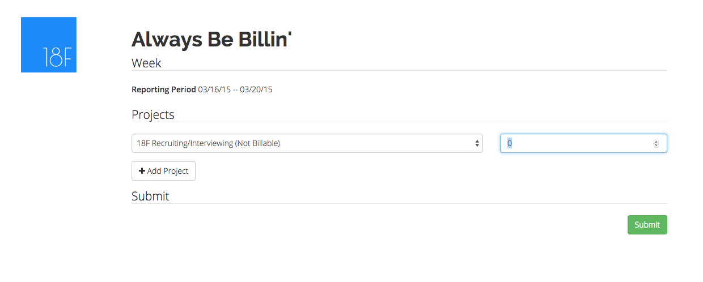

# Always Be Billin'

WIP.

[18F](https://18f.gsa.gov) is a great place to work because of its non-governmenty business model.  The best feature this model is the ability to charge our clients fees that cover not just the direct work we provide, but also the overhead activities that make our team better every day, like Guilds, Workgroups, Hub, and 20% time projects.

To ensure we can sustain this model (as well as export it to other digital service teams!), it is critical that we accurately report what we worked on each week.  This allows for each of our clients to pay their fair share and for 18F to properly manage its human resources (also known as people).

Since June 2014, we have addressed this need by recording weekly activities in a Google Sheet.  With 110+ employees and 25+ projects, this system is getting a bit unwieldy.  For the next iteration, 18F is putting together an easy-to-use Django application.  This will (hopefully) help recording your weekly activities easier, as well as make data extraction and analysis more painless.

Here's a screenshot:

